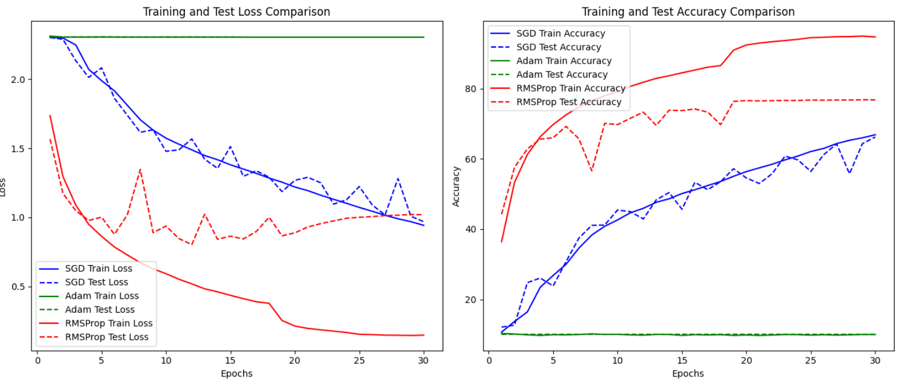

## Deep learning -  CNN with CIFAR-10 Dataset Image Classification

The CIFAR-10 dataset was used to evaluate the performance of a Convolutional Neural Network (CNN) on a complex, 10-class image classification task. Here are the main findings and architecture details:

### CNN Architecture for CIFAR-10

The CNN model consists of the following layers:

- **Convolutional Layers**:
  - `Conv Layer 1`: 32 filters, 3x3 kernel, ReLU activation, MaxPooling (2x2)
  - `Conv Layer 2`: 64 filters, 3x3 kernel, ReLU activation, MaxPooling (2x2)
  - `Conv Layer 3`: 128 filters, 3x3 kernel, ReLU activation, MaxPooling (2x2)
- **Fully Connected Layers**:
  - 256 and 128 neurons, followed by dropout (50%) to prevent overfitting
  - Final layer with 10 neurons and so

### Training and Evaluation
The model was trained over 30 epochs with the following components:

- **Optimizers:** `SGD`, `Adam`, and `RMSProp`
- **Learning Rate Schedulers:** `StepLR`, `ReduceLROnPlateau`, and `ExponentialLR`
- **Data Augmentation Techniques:** `Rotation`, `flipping`, and  `zooming`, applied to improve generalization.

#### Performance Comparison
The following plots show the comparison of training and test loss/accuracy for different optimizers used in the CNN model on CIFAR-10.

###  Results
- **SGD** with `ReduceLROnPlateau` achieved accuracies between 44.7% and 66.8%, showing improved but fluctuating test accuracy, which suggested some degree of overfitting.
- **Adam** performed poorly, yielding only 9-10% accuracy, possibly due to suboptimal hyperparameters or data preprocessing issues.
- **RMSProp** achieved the highest accuracy, but showed overfitting, with training accuracy around 90% and test accuracy around 70%, indicating that further regularization may be needed.
  
### Discussion and Conclusion
- **Best Performance:** `RMSProp with ReduceLR` and `ExponentialLR` achieved the highest training accuracy but displayed significant overfitting.
- **Future Directions:** A more complex architecture, such as `ResNet` or `DenseNet`, could better handle the CIFAR-10 dataset.
- **Impact of Data Augmentation:** Data augmentation significantly improved model stability and performance, especially on CIFAR-10, highlighting its importance in training models on complex datasets.

## Best Model for CIFAR-10 Image Classification

Based on the analysis of various models for CIFAR-10 image classification, the **best-performing model** was found to be a **Convolutional Neural Network (CNN)** with the **RMSProp optimizer** and **ReduceLROnPlateau learning rate scheduler**. This setup achieved the highest training accuracy among the tested configurations. However, some **overfitting** was observed, indicating that this basic CNN model may not generalize well to unseen data. A more advanced architecture, such as **ResNet** or **DenseNet**, is recommended for improved accuracy and generalization on CIFAR-10.

## Next Steps: User-Friendly Image Classification Application

To make this model accessible to users, a user-friendly application could be developed with the following features:

- **Image Upload Interface**: Allow users to upload images directly into the app.
- **Model Prediction**: Use the trained CNN model to classify the uploaded image, identifying objects like “horse,” “airplane,” or “car.”
- **Output Display**: Show the predicted class label and confidence score to the user.

This approach makes the CIFAR-10 classifier more interactive and practical, enabling real-time image classification for end-users.

