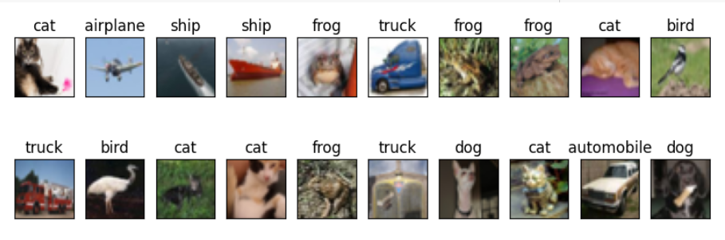

## CNN with CIFAR-10 Dataset

The CIFAR-10 dataset was used to evaluate the performance of a Convolutional Neural Network (CNN) on a complex, 10-class image classification task. Here are the main findings and architecture details.

### CNN Architecture for CIFAR-10

The CNN model consists of the following layers:

- **Convolutional Layers**:
  - `Conv Layer 1`: 32 filters, 3x3 kernel, ReLU activation, MaxPooling (2x2)
  - `Conv Layer 2`: 64 filters, 3x3 kernel, ReLU activation, MaxPooling (2x2)
  - `Conv Layer 3`: 128 filters, 3x3 kernel, ReLU activation, MaxPooling (2x2)
- **Fully Connected Layers**:
  - 256 and 128 neurons, followed by dropout (50%) to prevent overfitting
  - Final layer with 10 neurons and so
